

  

Role
<strong>Learner</strong>

  

Context
<strong>Claude Code</strong>

  

Timeline
<strong>April 2026</strong>

  

Type
<strong>Learning / Developer Tooling</strong>

  Claude Code
  Skills
  Extensibility
  AI Tools

---

## The FOMO of Too Many Tools

It's getting harder to keep up. Every week there's a new AI tool, a new feature, a new thing you're "supposed" to know about. I kept hearing about skills — at work, on Discord, YouTube titles all over the place — but I had no idea what it actually was. How to use it. If I even needed it.

## How I Actually Tackled It

Here's what I know about myself: I don't like pretending I understand things, and I learn better through practice than through reading. So instead of scrolling docs or watching a tutorial, I did the simplest thing possible.

**I asked Claude directly: "What are skills and how can I use them in my daily work?"**

That's it. No overthinking, no FOMO-driven research spiral. Just straight-up question.

I asked in chat and got info about built-in skills for creating documents, working on PDFs, and building UIs.

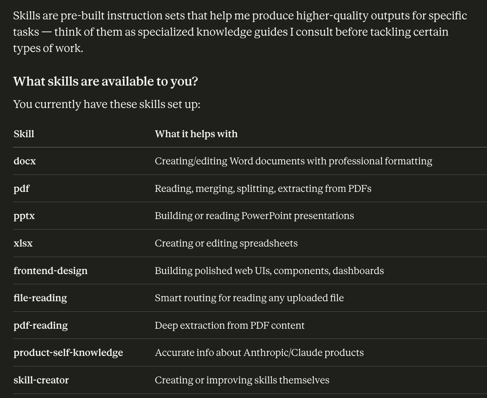

That was helpful, but one thing caught my attention: `/skill-creator` at the end. So I asked for more details:

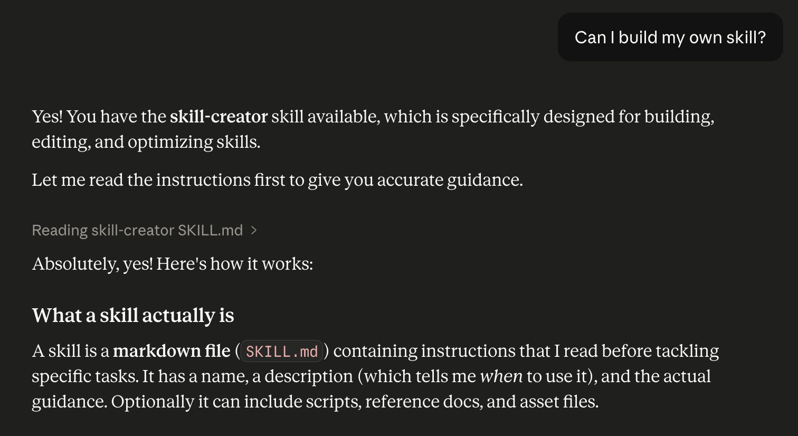

## Building My First Skill

I stopped for a moment to think about the most repetitive tasks I ask Claude to help with:
- "Explain this code fragment to me."
- "Create a feature request based on customer message and our Linear template"

I continued in chat:

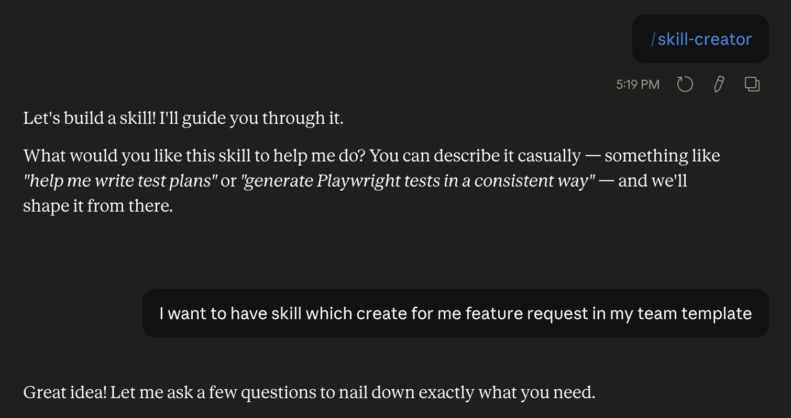

Claude asked me some clarifying questions.

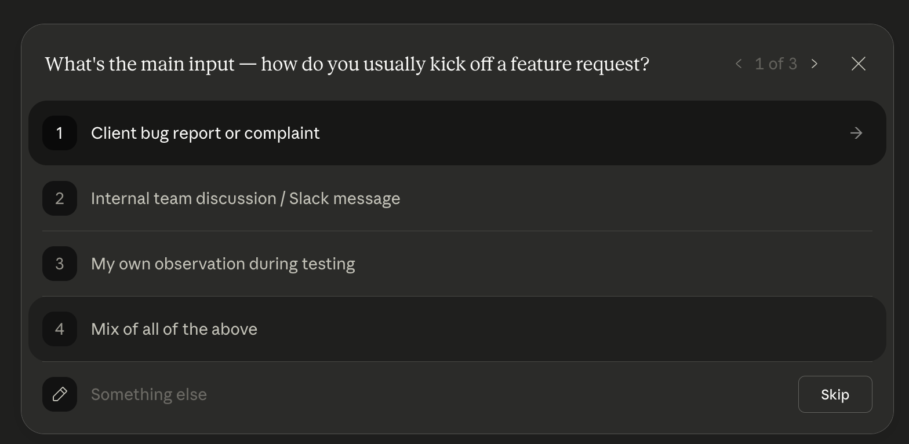

Then asked me to share the template. Claude even tested the skill with a sample question from memory.

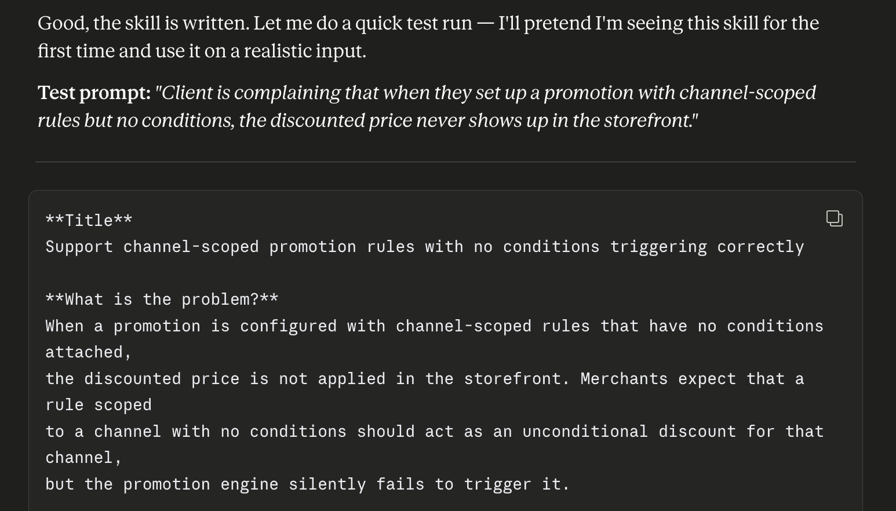

The skill was saved automatically.

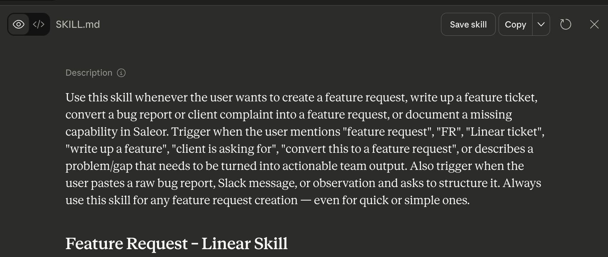

But that wasn't the end. At this point, the skill only worked in that session. To make it available across all chats, I needed to add it in the customize section. This way you can add skills created by someone else.

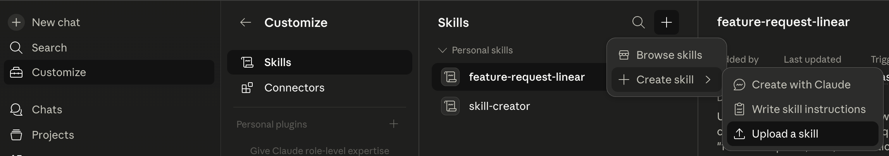

If you want the skill available in Claude Code itself, you need to add a folder and move the skill.md file there.

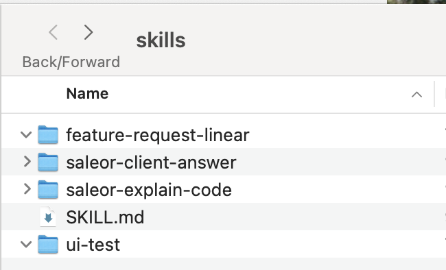

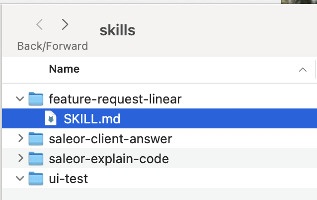

## I Built More

I created additional skills for:
- Analyzing Saleor core functionality and identifying test areas
- Documenting feature requests and bugs in standardized format
- Generating test scenarios and UI test templates in Playwright

These skills accelerated my daily workflow significantly.

Example for explain code skill:
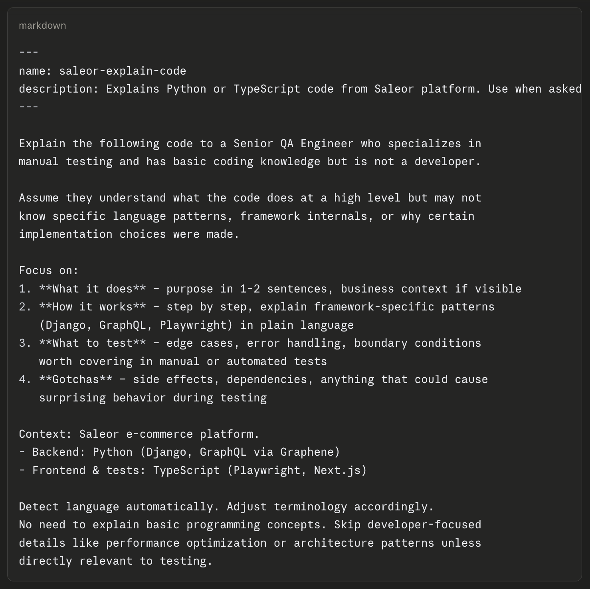
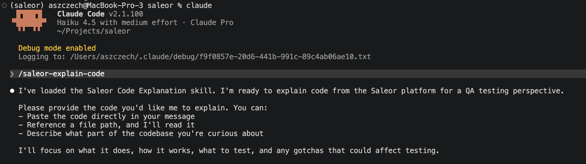
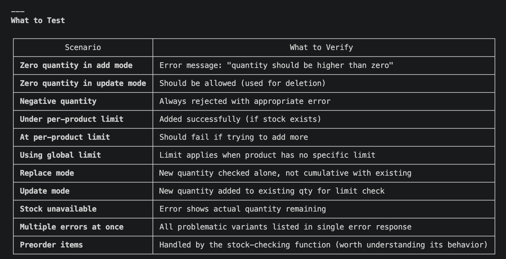

Once I had that first skills working, something became obvious. **Skills are just prompts you don't want to rewrite.**

If you find yourself:
- Asking Claude the same question over and over (with different inputs)
- Having a standard way you want Claude to approach a problem
- Wanting to encode domain knowledge or a specific workflow
- Wishing a tool felt native to Claude Code (not something you have to remember)

…then a skill makes sense.

## The Impact

- I understand what a skill is — just a prompt template living in your config
- I've built four custom skills that standardize my QA workflow: feature request reporting, bug documentation, and test reporting follow the same format every time
- I can now effectively generate well-structured feature requests and bug reports that match our team's standards — no more manual formatting or missing details
- My FOMO about new tools has decreased significantly

