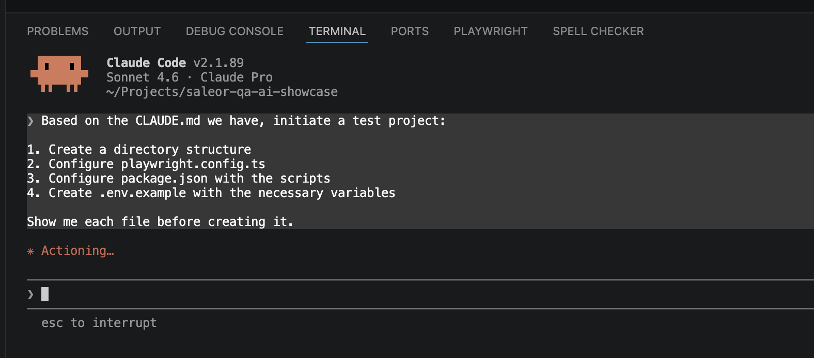
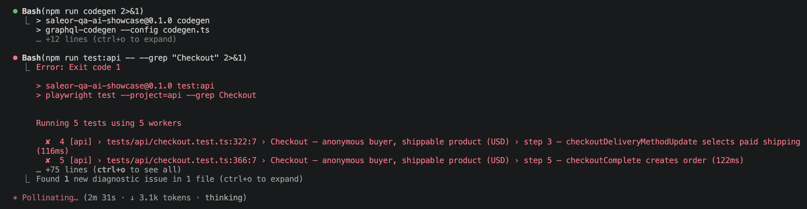
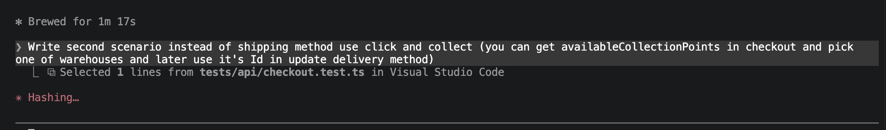
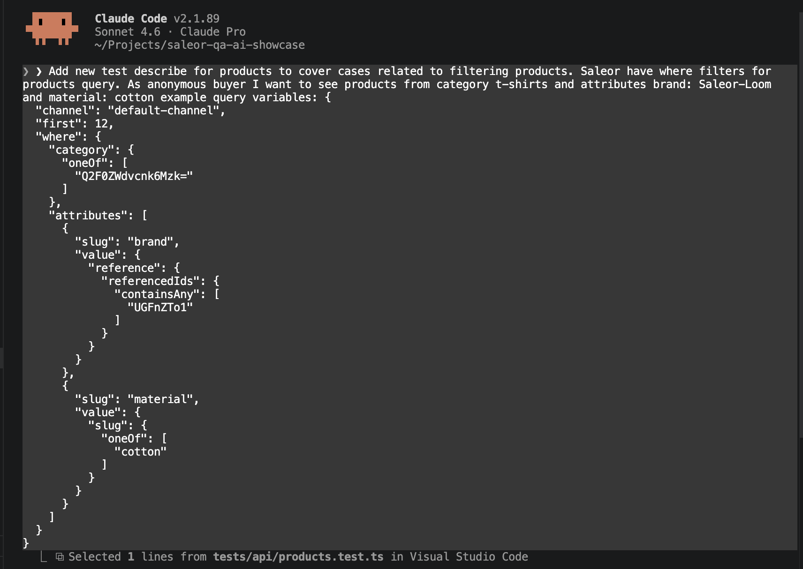
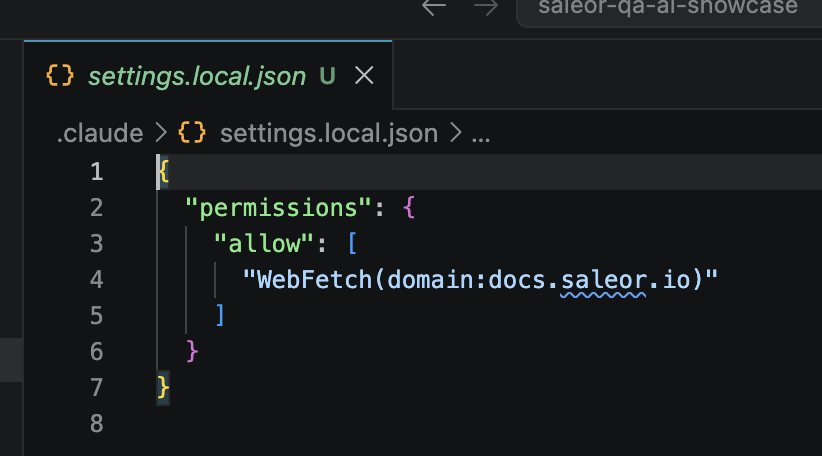

  

Role
<strong>QA Engineer</strong>

  

Context
<strong>Personal POC</strong>

  

Timeline
<strong>2026</strong>

  

Type
<strong>QA Framework / AI-Assisted Implementation</strong>

  Playwright
  Claude Code
  GraphQL
  TypeScript
  GitHub Actions

<a href="https://github.com/szczecha/saleor-qa-ai-showcase" target="_blank" rel="noopener noreferrer">View Repository →</a>

---

*This is Part 2 of a series. [Part 1](/blog/framework-architecture) covered designing the strategy and picking the stack with Claude Code.*

## Setting Up the Foundation

With `QA_STRATEGY.md`, `ADR-001`, and `CLAUDE.md` committed, I switched Claude Code from chat mode to the terminal and asked it to scaffold the project.

I gave it a single prompt: generate the full directory structure, `playwright.config.ts`, `codegen.ts`, `package.json`, `tsconfig.json`, `.env.example`, and `.gitignore`. Everything according to what was already in `CLAUDE.md`.

What came back in 44 seconds was a working skeleton: `tests/api/`, `tests/ui/`, `tests/a11y/`, `lib/generated/`, and all config files in place. Three Playwright projects — `api`, `ui`, `a11y` — defined in one `playwright.config.ts`.

Then the next steps in order: install dependencies, install the browser binary, set up the `.env` with Saleor Cloud sandbox values.

The last setup step was `npm run codegen`. It points at the live Saleor Cloud schema and generates TypeScript types into `lib/generated/`. The first run hit an error — a schema field the config referenced had changed.

Claude fixed it by reading the live schema introspection and updating the query. Second run passed.

From here on, a typo in a GraphQL query is a compile error, not a test failure at 2am.

## Layer 1: GraphQL API Tests

### Products

The first test was a product browsing scenario: anonymous user, USD storefront channel, querying the product list and a single product detail with variant pricing. I gave Claude the prompt, it read `CLAUDE.md` before writing a single line.

The client in `lib/graphql-client.ts` is a thin wrapper around `graphql-request`. Typed variables, typed response, no Apollo, no runtime state — exactly what the ADR specified. Each query lives in its own `.graphql` file; codegen picks it up automatically.

The tests passed on the first run.

One thing the strategy made explicit: HTTP 200 doesn't mean success in GraphQL. Every test asserts `data.X.errors` is empty, not just that the response arrived.

### Checkout

The checkout flow was the first place I had to push back on Claude's output. The default scaffold ran checkout steps in parallel — `checkoutCreate`, `checkoutLinesAdd`, `checkoutEmailUpdate`, delivery selection, `transactionInitialize`, `checkoutComplete` — and they failed because each step depends on the ID from the previous one.

I told Claude to switch the checkout tests to serial mode. That's `test.describe.serial` in Playwright — each step runs in sequence within the describe block, passing state forward.

The second checkout scenario — click & collect vs. standard shipping — required domain knowledge. Saleor's click & collect delivery doesn't go through the shipping methods list; it uses a warehouse directly. Claude got the structure right but picked the wrong delivery mutation on the first attempt.

That's the pattern that repeated: Claude handles the boilerplate and wiring correctly; I corrected the business logic where it needed Saleor-specific knowledge.

With checkout covered, I asked Claude to add more product query coverage — filtering by category, brand, and material, checking that results respect the filter.

One consistent thing throughout: Claude reminded me to commit frequently. It's right.

One environment issue worth noting: Playwright's default network policy blocked fetches to the Saleor Cloud domain. Needed an explicit `allowedDomains` in `playwright.config.ts` for the API project — a one-liner, but not obvious from the error message.

## Layer 2: Dashboard UI Tests (What's Next)

The UI layer follows one rule: tests don't create their own data through the browser unless creating that data *is* the test. Everything else is seeded via the API in `beforeAll` — the ID comes back, gets passed into the test scope, and the browser starts on a known state.

That pattern eliminates an entire category of flakiness. It also means selectors stay stable: `data-testid` and `aria-*` attributes only. MUI class names change on minor version bumps — they're not a contract.

`page.waitForResponse` on GraphQL mutations, not DOM transitions. A spinner disappearing doesn't confirm the mutation succeeded.

## Layer 3: Accessibility (What's Next)

`@axe-core/playwright` runs inside the same Playwright process and inherits `storageState` from the UI layer. No separate login, no reimplemented auth flow. That's the only reason it can scan auth-gated pages like the Dashboard product creation form — which is exactly where the most complex UI lives.

"0 critical axe violations" is a specific claim: no WCAG 2.1 AA violations at the `critical` or `serious` level. Not "accessible." A defined, testable threshold.

## CI with GitHub Actions

The workflow runs in three stages: API → UI → A11y. Each depends on the previous — if the API layer has P0 failures, there's no point running UI tests against broken data.

P0 failures block merge. P1–P3 are advisory — they run, they report, they don't break the build. That maps directly to the priority table in `QA_STRATEGY.md`.

Two details worth calling out: `~/.cache/ms-playwright` is cached between runs. The browser binary is 300 MB — re-downloading it on every workflow run is avoidable waste. And every job uses `--pass-with-no-tests`. The UI and A11y directories are currently empty placeholders; without that flag, Playwright exits with a non-zero code on empty test suites and breaks CI before there's anything to test.

## How AI Accelerated This

The strategy document became the AI's instruction set. Every Claude Code session started by reading `CLAUDE.md` — so the tool constraints, layer separation rules, and selector conventions were enforced automatically without me repeating them.

AI helped most with: boilerplate (the scaffolding, the client wrapper, the CI YAML), consistency (applying the same pattern across every test file), and schema navigation (finding the right codegen config against a live introspection endpoint).

Human judgment was essential for: test priorities (what's P0 vs P1 is a business call, not a technical one), the checkout delivery variants (knowing that click & collect uses a warehouse ID, not a shipping method), and data ownership — deciding that UI tests never create their own test data required understanding what makes tests flaky, not just what makes them compile.

## Lessons Learned

**Start with the strategy doc.** It becomes the AI's instruction set via `CLAUDE.md`. Without it, every session drifts.

**Strict layer boundaries prevent flakiness.** The rule "UI tests don't create data through the browser" sounds obvious — but without it written down, it won't hold under pressure to ship tests faster.

**Codegen setup cost is real but front-loaded.** The first run error took time to debug. After that, every schema-breaking change surfaced at compile time, not in CI.

**The "≤ 2 files per new test" metric.** A new test should touch at most two files: the test file and, if needed, one shared helper. If it takes more than that, the test is doing too much or the structure is fighting you.

## Where It Stands

The API layer is passing. Nine tests covering product browsing and the full checkout flow — including both delivery variants — run in CI on every push. The UI and A11y layers are scaffolded, with placeholder directories and the config wired up. The next session starts with a working environment, not a blank slate.

The POC definition of done: 9 tests passing in CI, a README sufficient for a new developer to add a test in under 30 minutes. The first part is done.

---

Claude's summary of the full session — from strategy through scaffolding to passing API tests:

