

  

Role
<strong>QA Engineer</strong>

  

Context
<strong>Personal POC</strong>

  

Timeline
<strong>2026</strong>

  

Type
<strong>QA Framework / AI-Assisted Implementation</strong>

  Playwright
  Claude Code
  GraphQL
  TypeScript
  GitHub Actions

<a href="https://github.com/szczecha/saleor-qa-ai-showcase" target="_blank" rel="noopener noreferrer">View Repository →</a>

---

*This is Part 2 of a series. [Part 1](/blog/framework-architecture) covered designing the strategy and picking the stack with Claude Code.*

## Setting Up the Foundation

With `QA_STRATEGY.md`, `ADR-001`, and `CLAUDE.md` committed, I switched from chat mode to the terminal and asked Claude to start working implementation.

I gave it a single prompt: generate the full directory structure, with `playwright.config.ts`, `package.json` and `.env.example` everything according to what was already in `CLAUDE.md`.

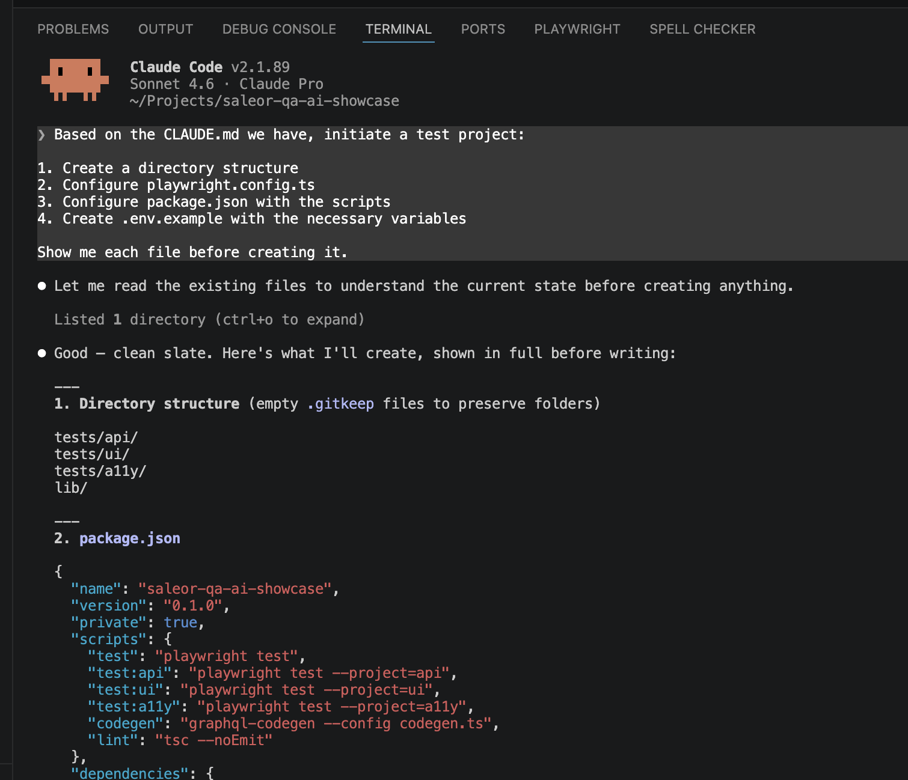

What came back in 44 seconds was a working skeleton: `tests/api/`, `tests/ui/`, `tests/a11y/`, `lib/generated/`, and all config files in place. Three Playwright projects — `api`, `ui`, `a11y` — defined in one `playwright.config.ts`.

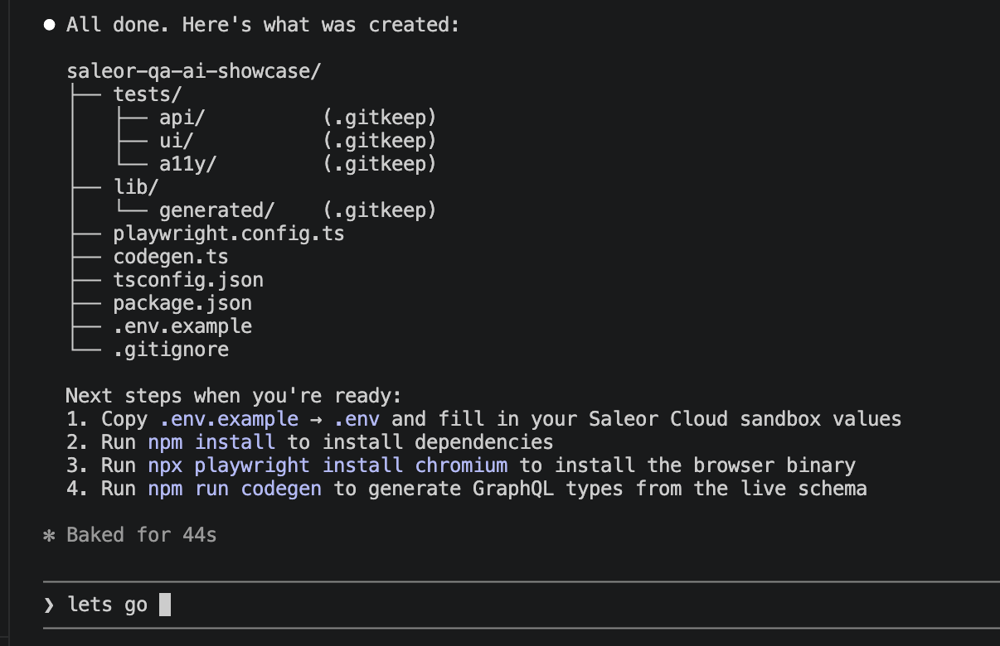

Then the next steps in order: install dependencies, install the browser binary.

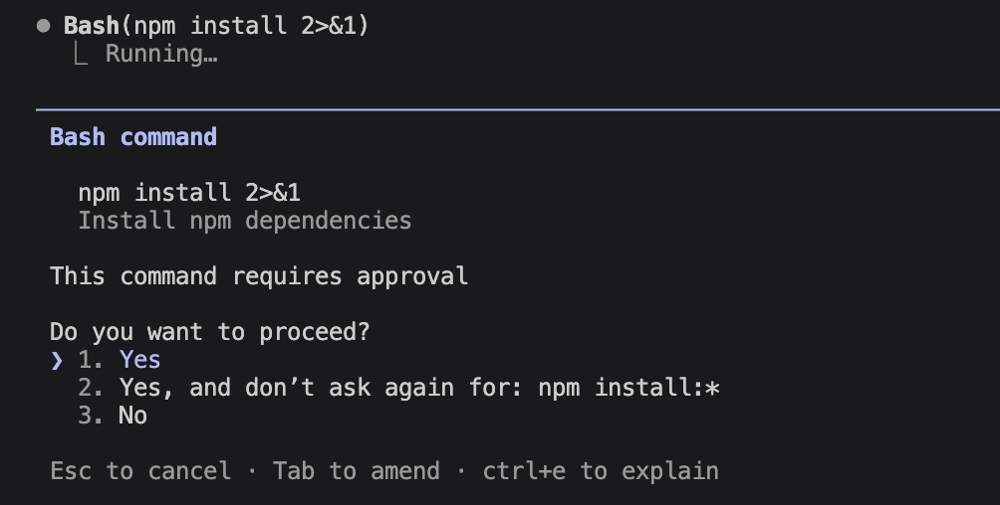

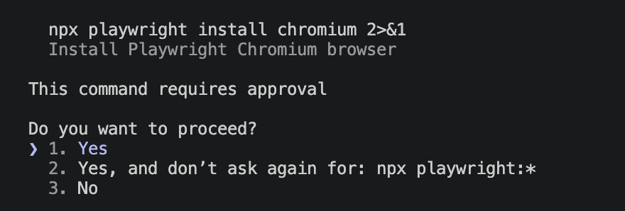

Before running `codegen` I had to set up the `.env` with Saleor Cloud sandbox values.

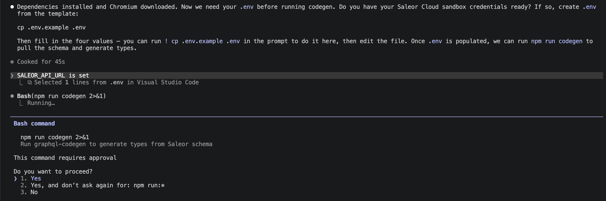

The last setup step was `npm run codegen`. It points at the live Saleor Cloud schema and generates TypeScript types into `lib/generated/`. The first run hit an error — a schema field the config referenced had changed. 

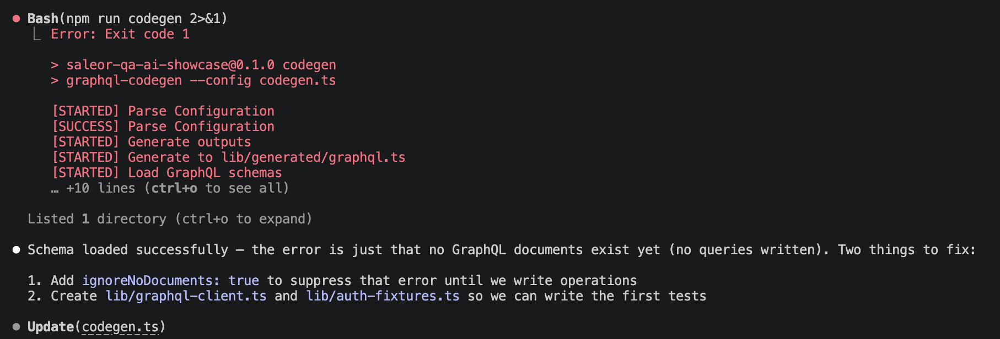

Claude fixed it by reading the live schema introspection and updating the query. Second run passed.

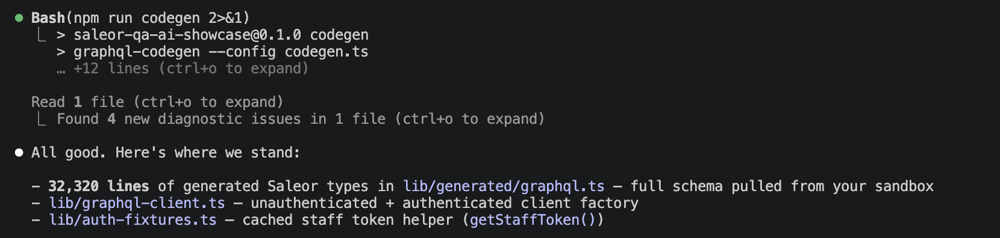

From here on, a typo in a GraphQL query is a compile error, not a test failure at 2am.

## Layer 1: GraphQL API Tests

### Products

The first test was a product browsing scenario: anonymous user, USD storefront channel, querying the product list and a single product detail with variant pricing.

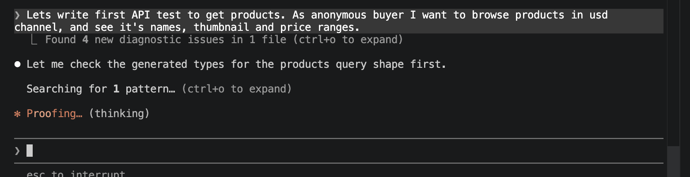

Claude generated the client and the test, but flagged one thing upfront: products query that can be used in public storefront requires a channel slug on every query — without it, no products are returned. It added `SALEOR_CHANNEL_USD` to `.env.example` and read it from the environment in the test and added fallback if value is not set.

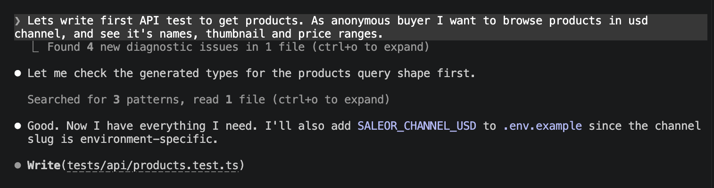

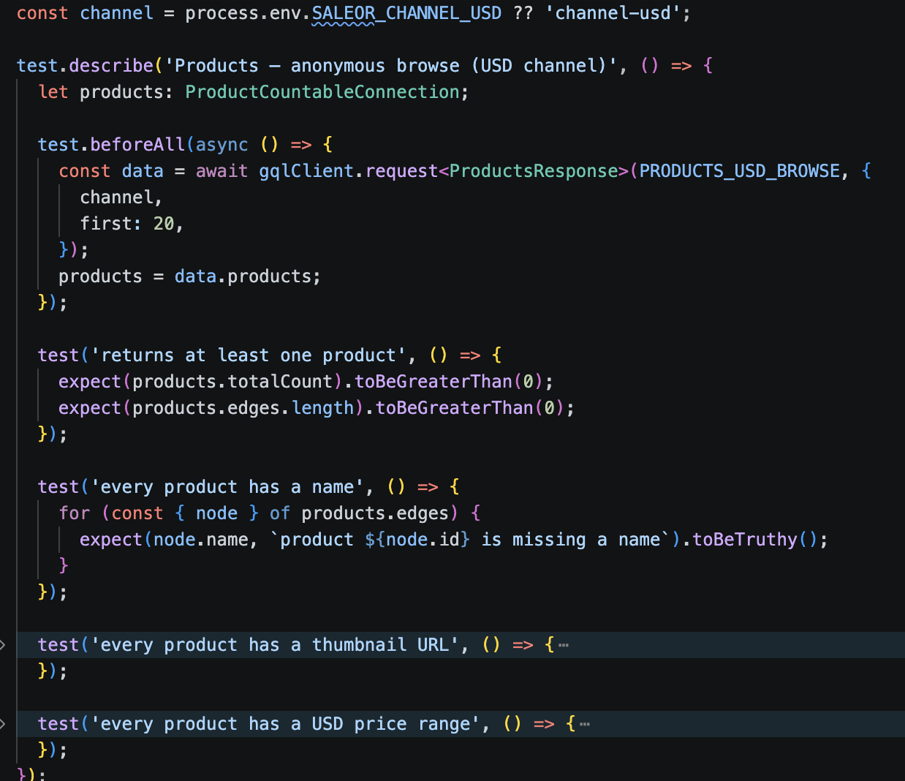

One habit worth keeping when working with an LLM: commit frequently. It's easy to lose a working state when iterating. I committed after each meaningful step and used the built-in source control to generate commit messages.

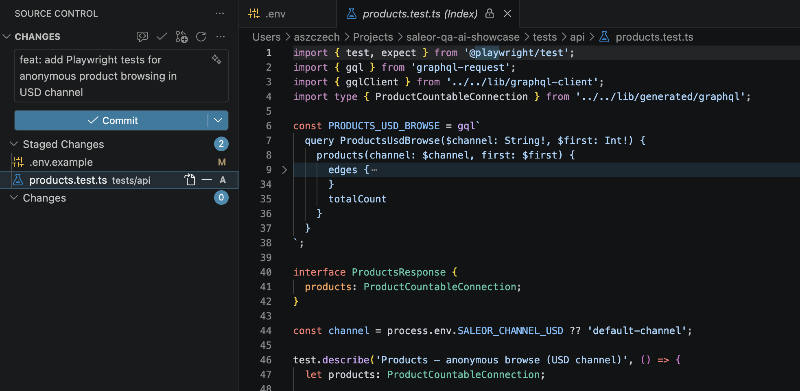

### Checkout

The checkout flow required more work. To get useful tests, I had to describe exactly which mutations are needed and in what order — covering every stage of the purchase process: `checkoutCreate` → `checkoutLinesAdd` → `checkoutEmailUpdate` → update addresses → delivery selection → `transactionInitialize` → `checkoutComplete`. On top of that, I had to make sure the test environment had a test payment app installed — without it, the transaction step has nowhere to route.

The second problem was execution order. Claude ran the steps in parallel, and they failed because some mutation depends on the ID returned by the previous one.

Claude caught this one on its own — it switched the checkout tests to `test.describe.serial`, so each step runs in sequence within the describe block, passing state forward.

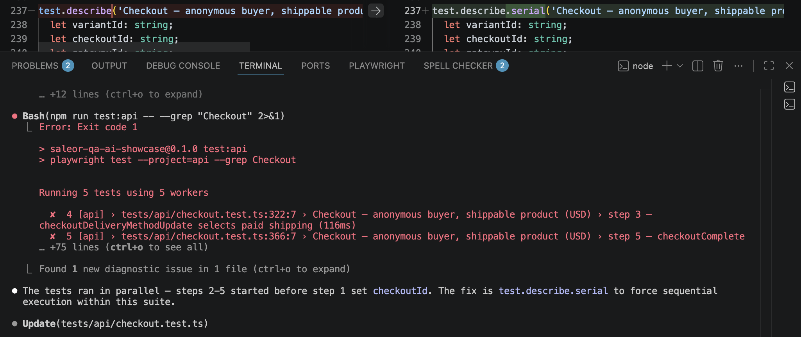

The next scenario was click & collect. I pointed out which fields held the warehouse ID and that it passes through the same `checkoutDeliveryMethodUpdate` mutation — domain knowledge that's worth putting in the prompt — and Claude produced the right test from that.

Once the checkout scenarios were done, I asked Claude to do some housekeeping — move shared queries to a separate file.

## CI with GitHub Actions

With a few API tests working locally, I wanted to get them running in CI. I asked Claude to generate a GitHub Actions workflow with caching and it handled most of it well. 

One issue came up: each layer was running the full Playwright setup — all projects — instead of just its own. That was a dependency configuration problem in `playwright.config.ts`, so I removed the dependencies for now. The other fix was adding `--pass-with-no-tests` to every job. The UI and A11y directories are currently empty placeholders, and without that flag Playwright exits with a non-zero code on an empty test suite, which breaks CI before there's anything to test.

## Where It Stands

The API layer is passing. 23 tests across four areas: simple product queries, advanced product queries with attribute filtering (category, brand, material), checkout with standard delivery, and checkout with click & collect. All running in CI on every push.

I asked Claude to update `CLAUDE.md` with what we'd established in the session — so the next session picks up from the same baseline. Then we updated the project README, and finally I asked for a session summary. I was genuinely surprised by how much got done in a single afternoon:

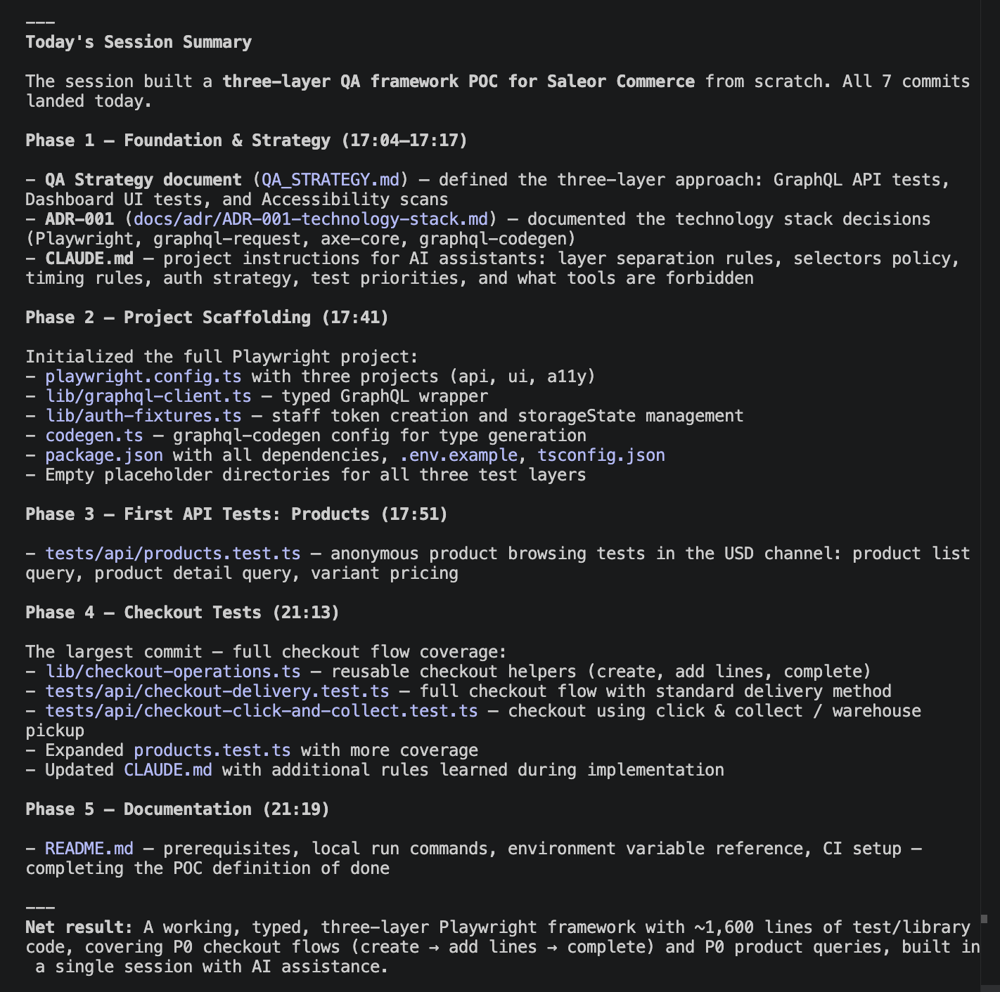

