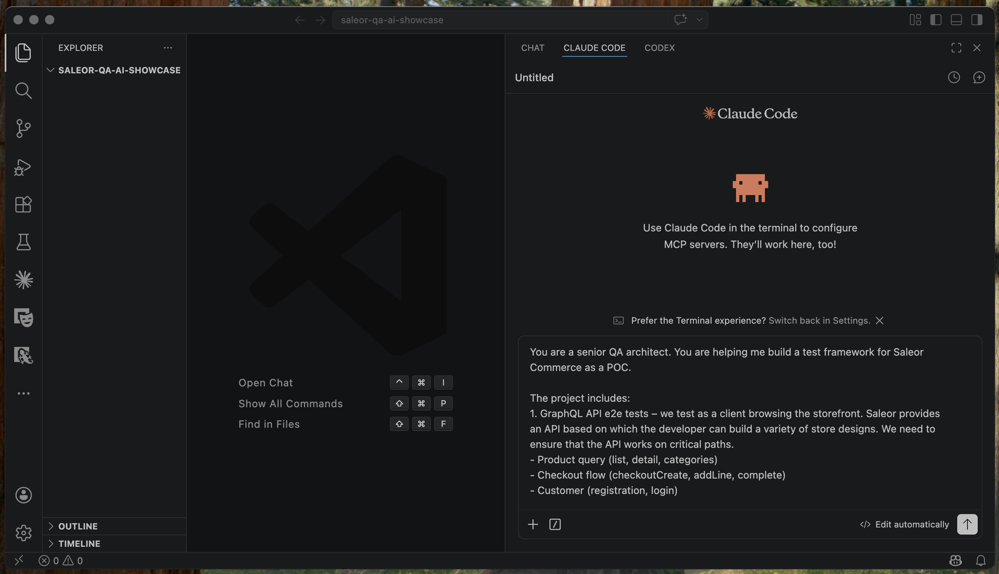
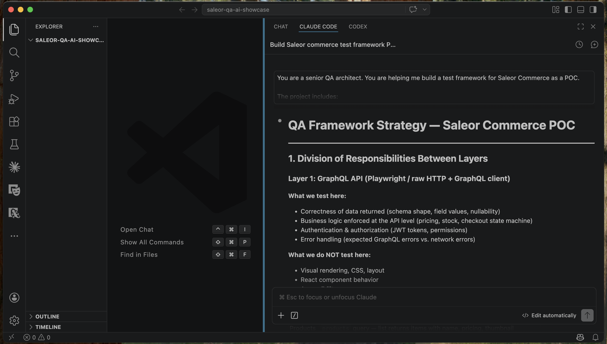
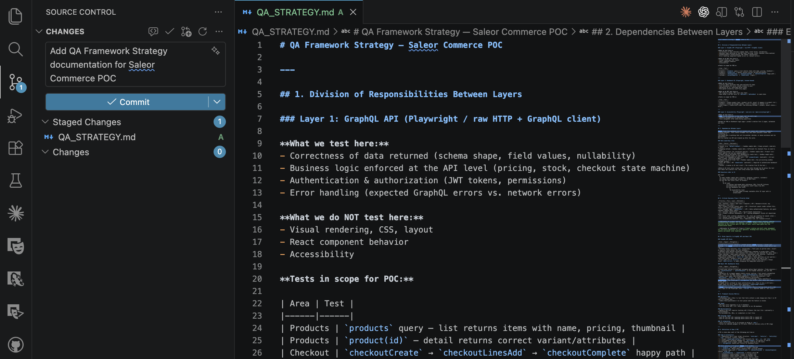
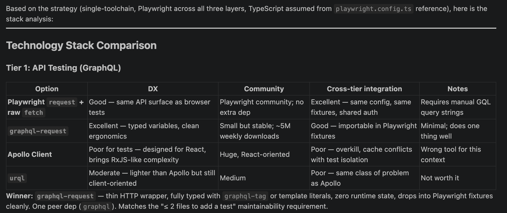
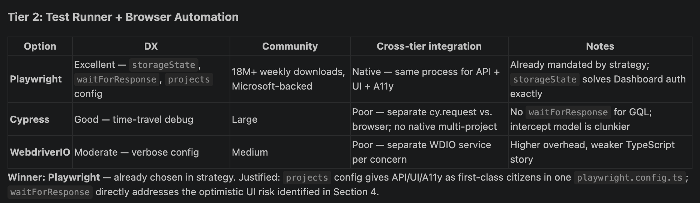
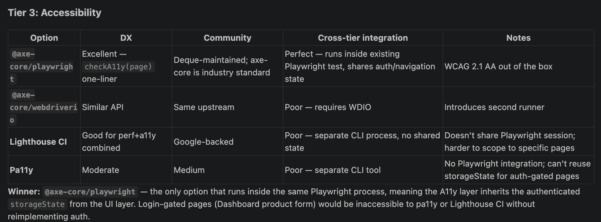
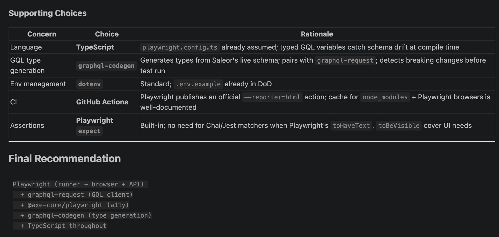
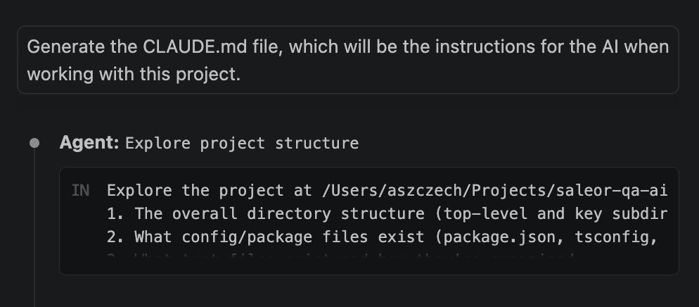
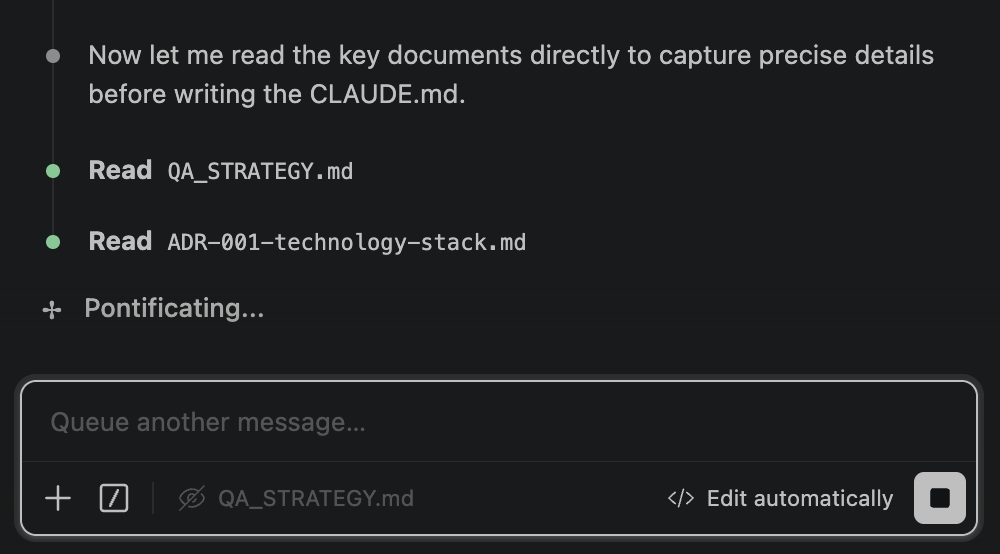
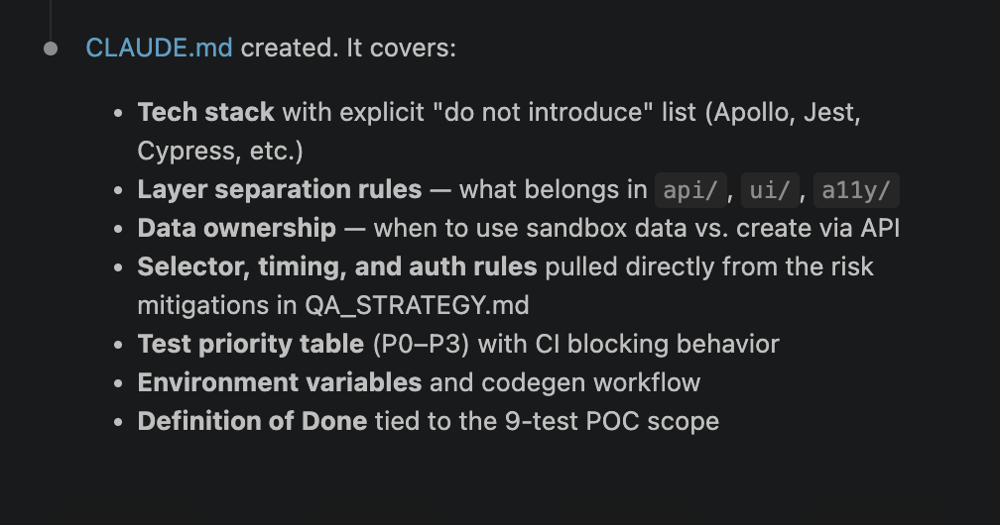

<div style="display:flex;gap:3rem;margin-bottom:1.5rem;flex-wrap:wrap;">
  <div><div style="font-size:0.7rem;letter-spacing:0.1em;text-transform:uppercase;color:var(--meta-label-color);margin-bottom:0.25rem;">Role</div><strong>QA Engineer</strong></div>
  <div><div style="font-size:0.7rem;letter-spacing:0.1em;text-transform:uppercase;color:var(--meta-label-color);margin-bottom:0.25rem;">Context</div><strong>Personal POC</strong></div>
  <div><div style="font-size:0.7rem;letter-spacing:0.1em;text-transform:uppercase;color:var(--meta-label-color);margin-bottom:0.25rem;">Timeline</div><strong>2026</strong></div>
  <div><div style="font-size:0.7rem;letter-spacing:0.1em;text-transform:uppercase;color:var(--meta-label-color);margin-bottom:0.25rem;">Type</div><strong>QA Architecture / AI-Assisted Design</strong></div>
</div>

<div class="not-prose flex flex-wrap gap-1.5 mb-6">
  <span class="font-mono text-xs px-3 py-1 rounded bg-slate-100 text-slate-700 dark:bg-slate-800 dark:text-slate-300">Playwright</span>
  <span class="font-mono text-xs px-3 py-1 rounded bg-slate-100 text-slate-700 dark:bg-slate-800 dark:text-slate-300">Claude Code</span>
  <span class="font-mono text-xs px-3 py-1 rounded bg-slate-100 text-slate-700 dark:bg-slate-800 dark:text-slate-300">GraphQL</span>
  <span class="font-mono text-xs px-3 py-1 rounded bg-slate-100 text-slate-700 dark:bg-slate-800 dark:text-slate-300">TypeScript</span>
  <span class="font-mono text-xs px-3 py-1 rounded bg-slate-100 text-slate-700 dark:bg-slate-800 dark:text-slate-300">Accessibility</span>
</div>

<a href="https://github.com/szczecha/saleor-qa-ai-showcase" target="_blank" rel="noopener noreferrer">View Repository →</a>

---

## The Problem

I recently completed the <a href="https://aitesters.pl/" target="_blank" rel="noopener noreferrer">AI_Testers</a> course — a training focused on building test automation frameworks with AI assistance. The first edition was centered mostly on Copilot, so I wanted to go further: learn a different tool, get hands-on with it, and build something real.

I chose Claude Code, and the problem I gave it was designing a QA framework for Saleor Commerce from scratch. GraphQL-only API, React SPA dashboard, auth-gated pages. Enough moving parts that architecture decisions actually matter. I know Saleor well, which was the point — my domain knowledge meant I could evaluate Claude's output properly, not just accept whatever it produced.

This repository and this article are the documentation of that process.

## Strategy First

I wanted to use Claude as a thinking partner, so before touching any code or tooling, I asked for a strategy.

I opened a Claude Code session in VS Code, set the context — senior QA architect, Saleor Commerce POC, three testing concerns — and asked for a QA strategy before anything else.



What came back was a `QA_STRATEGY.md` covering layer separation, explicit scope boundaries per layer, P0–P3 test priorities, and data ownership rules. The layer boundaries were the most useful part: not just what each layer tests, but what it explicitly does *not* test. That distinction matters especially when AI is writing the code — without explicit boundaries, it will drift into whatever seems helpful.



The strategy went straight into source control. It became the contract for every decision that followed.



One honest note: my strategy already leaned toward Playwright, and I didn't challenge that when moving to stack selection. I wanted to use Playwright anyway for both the API and accessibility layers — so I wanted to validate the choice.

## Picking the Stack

With the strategy committed, I gave Claude the constraints — GraphQL API, React SPA, Saleor Cloud sandbox — and asked it to evaluate tool options for each layer with a comparison table and a justified recommendation.

### API Layer

Three options compared: Playwright's raw `fetch`, `graphql-request`, and Apollo Client. The winner was `graphql-request` — typed variables, clean ergonomics, zero runtime state, drops cleanly into Playwright fixtures. Apollo was ruled out immediately: wrong tool, overkill for testing.



### UI Layer

Playwright, Cypress, and WebdriverIO. Playwright won here too, but for a specific reason: `storageState`. It lets you capture authenticated browser state from the API layer and reuse it in UI tests without logging in again through the browser. For a dashboard that requires auth on almost every page, that's not a nice-to-have.



### Accessibility Layer

`@axe-core/playwright`, `@axe-core/webdriverio`, Lighthouse CI, and Pa11y. The key constraint here was auth — the Dashboard product form is only reachable when logged in. Pa11y and Lighthouse CI can't reuse a Playwright session, so they'd require implementing auth again. `@axe-core/playwright` runs inside the same process, inherits `storageState`, and surfaces WCAG 2.1 AA violations out of the box.



### The Final Stack

The three decisions converged on one unified toolchain:

```
Playwright (runner + browser + API)
  + graphql-request
  + @axe-core/playwright
  + graphql-codegen
  + TypeScript throughout
```



`graphql-codegen` generates types from Saleor's live schema — schema drift becomes a compile error, not a runtime surprise.

With the decision made, I asked Claude to write it up as an Architecture Decision Record — `ADR-001-technology-stack.md`. Every rejected option, every trade-off, every rationale documented and committed. ADRs are useful precisely because they capture not just what was decided, but why — and what was considered and ruled out along the way.

## Generating the CLAUDE.md

With `QA_STRATEGY.md` and `ADR-001-technology-stack.md` in place, I asked Claude Code to generate a `CLAUDE.md` — the instructions file that tells an AI assistant how to work in this project.



Claude read both documents before writing anything.



The result covered everything a future AI session would need to stay consistent: the tech stack with an explicit "do not introduce" list (no Apollo, no Jest, no Cypress), layer separation rules for `api/`, `ui/`, and `a11y/` directories, data ownership rules, selector and auth conventions pulled from the strategy's risk mitigations, the P0–P3 priority table with CI blocking behavior, and a Definition of Done tied to the 9-test POC scope.



## What Came Out of It

- A `QA_STRATEGY.md` that defined three testing layers with strict scope boundaries
- `ADR-001-technology-stack.md` justifying every tool choice with a comparison table
- A `CLAUDE.md` that makes the strategy machine-readable for future AI sessions
- One toolchain covering API, UI, and accessibility — with auth solved once via `storageState`

With all of that in place, I was ready to let Claude bootstrap the project and start writing tests — which is a story for the next post.

## How I Used Claude Code

This wasn't a single conversation — I used three different modes across the process.

**Chat** — the starting point for both the strategy and the stack selection. I gave Claude a role, the project constraints, and a specific output format, then iterated in the conversation. The `QA_STRATEGY.md` and the comparison tables both came out of this mode.

**File context** — once `QA_STRATEGY.md` existed, I attached it directly to the stack selection prompt. That let Claude reason against what was already decided rather than starting from scratch. Each prompt built on the previous output.

**Agent mode** — for generating `CLAUDE.md`, I switched to the agent. Instead of me describing the project, I asked Claude to explore it autonomously — read the files, understand the structure, then write the instructions. It read both `QA_STRATEGY.md` and `ADR-001-technology-stack.md` before producing anything.
