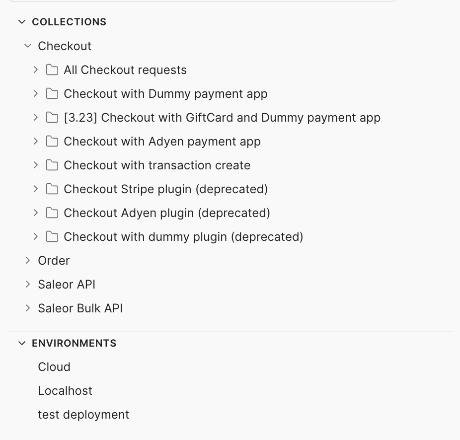
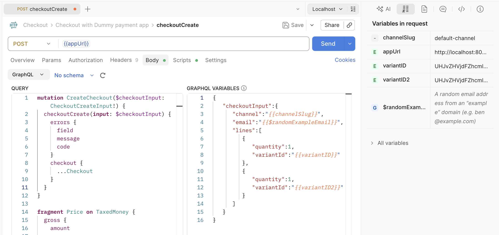
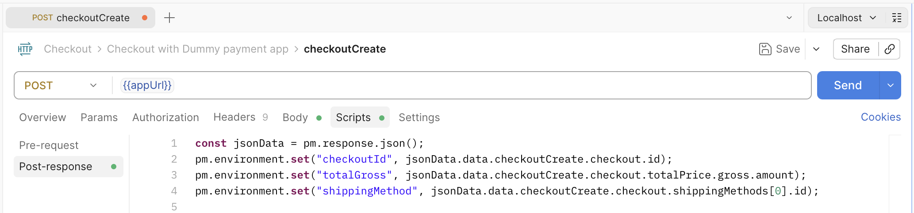
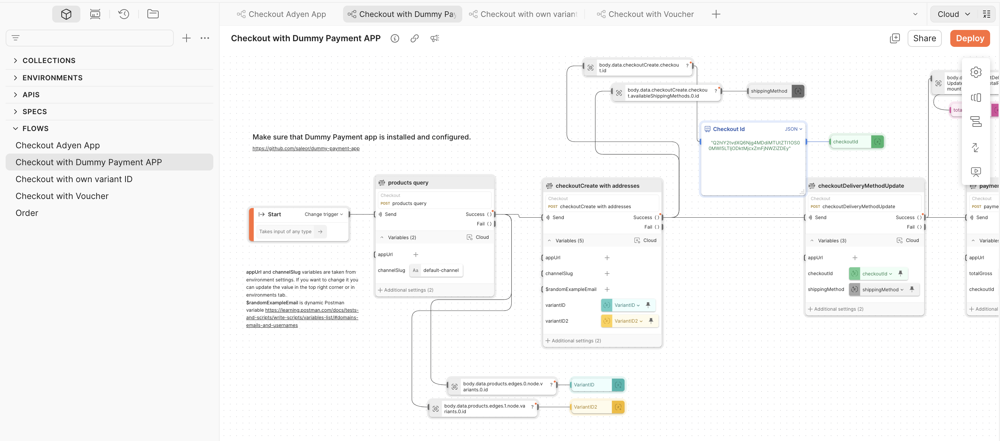

  

Role
<strong>Creator &amp; Maintainer</strong>

  

Company
<strong>Saleor Commerce</strong>

  

Timeline
<strong>2022 — 2024</strong>

  

Type
<strong>API Testing / Developer Tooling</strong>

  Postman
  GraphQL
  API Testing
  Documentation

<a href="https://www.postman.com/saleor-official/workspace/saleor/" target="_blank" rel="noopener noreferrer">View Collection →</a>

---

## The Problem

When I joined Saleor, there was no shared request collection. Everyone used their own tool — Postman, Insomnia, GraphQL Playground — and none of them had a shared, versioned collection. Every developer and QA was building requests from scratch, duplicating effort, and there was no single source of truth for how to call the API correctly.

## How It Started

### From Repetitive Requests to Organized Flows

While learning the API — new mutations, new queries — I kept sending the same requests over and over. So I started organizing them: putting related requests in sequence inside folders, each one representing a complete checkout flow.

Pretty quickly I had folders for different scenarios: a common checkout, checkout with a voucher, for digital products, with different payment methods, with different shipping addresses. I could use the Postman Collection Runner to execute an entire folder at once, multiple times, and instantly have orders to work with.

### Scripts & Environments

All requests were configured with pre-request and post-request scripts — extracting IDs, chaining tokens between steps, using dynamic variables for email addresses. I created multiple environments so I could effectively switch between staging, production, and local instances with one click.

### Flows

Next I discovered Postman Flows and created several. It was easier to manipulate and change variables in a single visual view, and run entire sequences with one click.

## Internal Adoption

At this point I showed the collection in a company demo and a few developers started using it right away.

I also created a smoke test suite during functional testing of new mutations. We ran it before releases to make sure all critical paths worked as expected.

## Going Public

Then a colleague shared an idea: Postman has a public directory of API collections where developers can discover ready-to-use examples. Why not publish ours there?

**The Pitch:**
- Low-hanging fruit — the collection already existed
- Developers and agencies could find Saleor ready-to-use examples, complementing docs and playgrounds
- Increased Saleor visibility in the Postman ecosystem
- Built-in support for scripts and tests — a DX improvement out of the box

After a cleanup pass and a security review to make sure no passwords or secrets leaked through environment variables, we published it as the official Saleor collection.

## Demo

<video controls style="width:100%;border-radius:0.5rem;">
  <source src="/videos/saleor-postman-collection-flow.mp4" type="video/mp4" />
</video>

## Impact

- Listed on Postman's Public API Network — discoverable by anyone
- Adopted by external developers and integration partners worldwide
- Reduced time-to-first-API-call for new Saleor users
- Confirmed via Postman's 2025 Rewind that the collection has active, ongoing usage

The collection isn't something we actively update on a schedule — but it's alive. Sometimes I spot a comment on Discord that the collection is missing a particular mutation, and I add it. It's community-driven maintenance at a low but steady pace.
